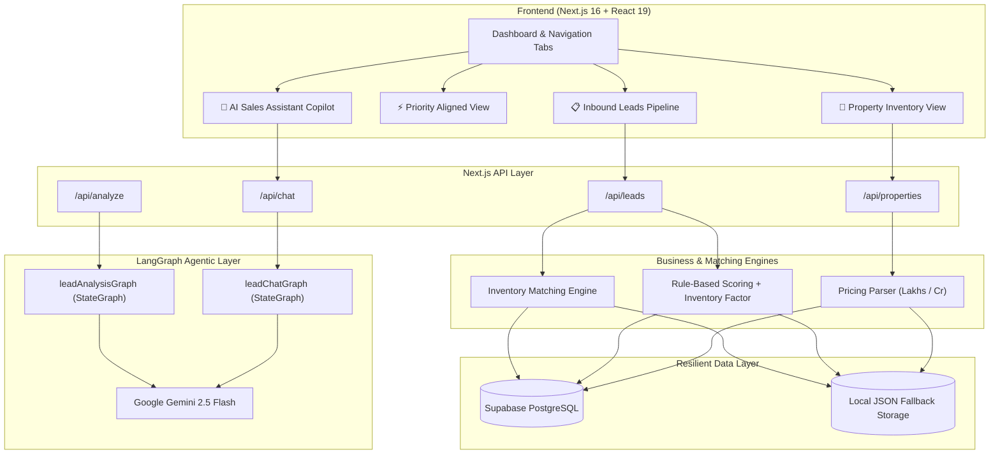

# 🏠 RealEstate AI — Lead Copilot & Inventory Matcher

[](https://nextjs.org/)
[](https://react.dev/)
[](https://langchain.com/)
[](https://ai.google.dev/)
[](https://supabase.com/)
[](https://www.typescriptlang.org/)

An enterprise-ready AI copilot and lead qualification engine for real estate brokerages and sales teams. RealEstate AI ingests inbound buyer inquiries, performs deep qualitative requirement analysis with **LangGraph**, scores prospect readiness, maintains currently held flats and apartments, and dynamically upgrades lead priority to **HOT** when an exact inventory property match is in stock.

---

## 📑 Table of Contents
1. [What We Built](#-what-we-built)
2. [Architecture Overview](#-architecture-overview)
3. [AI Model & API Integration](#-ai-model--api-integration)
4. [How to Run Locally](#-how-to-run-locally)
5. [Key Technical Decisions](#-key-technical-decisions)
6. [Known Limitations](#-known-limitations)

---

## 🚀 What We Built

RealEstate AI addresses the primary bottlenecks in real estate sales: manual lead qualification, mismatched property recommendations, and slow response drafting.

### Key Capabilities

1. **Intelligent Inbound Lead Ingestion & Qualification**:
   - Captures buyer name, budget, target location, property configuration (BHK/type), buying timeline, and customer inquiries.
   - Evaluates multi-factor readiness: urgency, budget clarity, timeline overrides (e.g., *"not this year"* correctly forces COLD), and customer engagement.

2. **🏢 Property Inventory Management (Flats & Apartments)**:
   - A dedicated inventory management dashboard to store and manage currently held flats, apartments, penthouses, and commercial units.
   - Tracks asking prices, carpet area (sq ft), possession status, floor numbers, and verified amenities (e.g., *East-facing, Vastu certified, Private terrace*).
   - Real-time inbound lead match counter on each property card showing which prospective buyers align with that unit.

3. **🔥 Inventory-Driven Lead Prioritization**:
   - Dynamic matching engine analyzing geographic proximity, configuration/BHK overlap, and budget tolerance.
   - **Guaranteed HOT Upgrade**: If a held inventory unit matches a lead's requirements, the lead is immediately promoted to **HOT Priority** with an algorithmic score boost ($\ge 82/100$) and linked directly to the property.

4. **⚡ Priority-Wise & Matched Properties View**:
   - A single-click view displaying all current leads ordered strictly by priority (**HOT $\rightarrow$ WARM $\rightarrow$ COLD**).
   - Each card aligns the buyer profile on the left with the exact matching apartment unit on the right.
   - **One-Click AI Pitch**: Clicking *"Pitch this Apartment with AI"* loads the buyer and the flat directly into the AI Copilot to draft a personalized pitch email or WhatsApp message.
   - **Executive Alignment Matrix**: Tabular modal overview summarizing the entire pipeline alongside matched inventory.

5. **🤖 AI Sales Assistant Copilot (Dual-Mode)**:
   - **Focused Lead Context**: Analyzes requirements, detects objections, and crafts consultative site-visit invitations for a selected buyer.
   - **Full Pipeline Context**: Answers questions across the entire sales funnel (e.g., *"Which buyers should I contact first this morning?"* or *"What 3 BHK units are available in Whitefield?"*).

---

## 🏛️ Architecture Overview

The system is built on Next.js 16 with a decoupled, modular architecture spanning client UI, API routes, LangGraph AI state machines, and resilient persistence.



### Data Flow
1. **Lead Submission**: Stored in Supabase PostgreSQL; evaluated against inventory to compute initial priority.
2. **Pipeline Calibration**: Upon fetching `/api/leads`, the engine cross-references all leads against active inventory properties using `applyInventoryCalibration()`.
3. **AI Execution**: `/api/analyze` triggers LangGraph state transitions:
   `analyzeLeadNode` $\rightarrow$ `calculateScoreNode` $\rightarrow$ `generateResponseNode` $\rightarrow$ Supabase persist.
4. **Interactive Copilot**: `/api/chat` invokes `leadChatGraph`, providing the LLM with grounded buyer profiles and held property inventory.

---

## 🧠 AI Model & API Integration

### Model Selected
- **Google Gemini 2.5 Flash** (`gemini-2.5-flash`)
- Provider: Google Generative AI via `@langchain/google-genai`

### How It Is Configured & Called

The model is initialized in `lib/ai/model.ts`:

```typescript
import { ChatGoogleGenerativeAI } from "@langchain/google-genai";

export const model = new ChatGoogleGenerativeAI({
  model: "gemini-2.5-flash",
  apiKey: process.env.GEMINI_API_KEY,
  temperature: 0.2, // Low temperature for factual, deterministic reasoning
});
```

### Structured Output Extraction
Rather than free-form text prompting, we bind deterministic **Zod schemas** to enforce strict JSON contracts:

```typescript
// lib/ai/schemas.ts
export const leadAnalysisSchema = z.object({
  leadSummary: z.string().describe("Concise summary of inquiry"),
  customerIntent: z.string().describe("Primary intent and readiness"),
  keyRequirements: z.array(z.string()).describe("Extracted concrete requirements"),
  objections: z.array(z.string()).describe("Explicit or implied hurdles"),
  recommendedNextAction: z.string().describe("Strategic next step for salesperson"),
});

// Calling the model with structured output:
const modelWithStructure = model.withStructuredOutput(leadAnalysisSchema);
const analysis = await modelWithStructure.invoke(formattedPrompt);
```

### Orchestration via LangGraph
Workflows are modeled as a Directed Acyclic Graph (`StateGraph`) using `@langchain/langgraph`:
- **Lead Analysis Graph** (`lib/ai/graphs/lead-analysis.ts`):
  1. `analyzeLead`: Extracts qualitative requirements and objections.
  2. `calculateScore`: Computes rule-based score factoring in matched inventory units.
  3. `generateResponse`: Drafts an initial outreach email grounded in buyer requirements and matching property specs.
- **Lead Chat Graph** (`lib/ai/graphs/lead-chat.ts`):
  Streams context-grounded recommendations to sales agents, preventing hallucinations and ensuring only verified held inventory properties are pitched.

---

## 💻 How to Run Locally

### Prerequisites
- **Node.js**: v18.18.0 or later (Node v20+ recommended)
- **Supabase Account**: (Free tier is sufficient)
- **Google AI Studio API Key**: For Gemini 2.5 Flash

### Step 1: Clone the Repository
```bash
git clone https://github.com/kumarnitn/realestate-ai.git
cd realestate-ai
```

### Step 2: Install Dependencies
```bash
npm install
```

### Step 3: Configure Environment Variables
Copy `.env.example` to `.env.local`:
```bash
cp .env.example .env.local
```

Edit `.env.local` with your credentials:
```env
NEXT_PUBLIC_SUPABASE_URL=https://your-project.supabase.co
NEXT_PUBLIC_SUPABASE_ANON_KEY=your-supabase-anon-key
GEMINI_API_KEY=your-gemini-api-key
```

### Step 4: Run Supabase Migrations
Execute the SQL migration scripts in your **Supabase SQL Editor** in numerical order:
1. `supabase/migrations/001_create_leads.sql` (Creates `leads` table)
2. `supabase/migrations/002_add_lead_analysis.sql` (Adds qualitative analysis and score columns)
3. `supabase/migrations/003_fix_analysis_status.sql` (Adds analysis status indexes)
4. `supabase/migrations/004_create_properties.sql` (Creates `properties` table for held flats)

### Step 5: (Optional) Seed Sample Leads & Inventory
To populate the database with realistic inbound leads and held inventory flats:
```bash
node --env-file=.env.local seed_sample_leads.mjs
```

### Step 6: Start the Development Server
```bash
npm run dev
```

Open [http://localhost:3000](http://localhost:3000) in your browser.

---

## ⚖️ Key Technical Decisions

| Decision | Rationale | Alternatives Considered |
| :--- | :--- | :--- |
| **Hybrid Rule-Based + Inventory Scoring** | Pure LLM scoring is non-deterministic and can produce inconsistent classifications. Our hybrid algorithm deterministically enforces timeline overrides and immediately boosts leads to HOT when an inventory match is held. | 100% LLM prompt scoring (rejected due to hallucinations and score drift). |
| **LangGraph over Monolithic Chains** | Breaks qualitative analysis, priority calculation, and pitch generation into distinct stateful nodes. If one step encounters an error, earlier state is preserved. | Single large prompt (rejected due to token overhead and lack of error boundaries). |
| **Resilient Dual-Layer Persistence** | Combines Supabase PostgreSQL with an automatic local JSON storage fallback (`lib/db/properties.ts`), allowing the app to run seamlessly even without remote DB access. | Strictly cloud-only DB (would crash during onboarding if tables were missing). |
| **Isomorphic Pricing Engine** | `parsePriceToLakhs` parses Indian real estate expressions (*"₹4.5 Cr"*, *"95 Lakhs"*) into normalized numeric units for instant sorting on both client and server bundles. | Server-only parsing (would cause UI latency on filter updates). |
| **Structured Output via Zod** | Guarantees typed JSON from Gemini 2.5 Flash, preventing malformed outputs or broken UI fields. | Raw regex string parsing (fragile and error-prone). |

---

## ⚠️ Known Limitations

1. **Free Tier API Rate Limits**:
   - The Google Gemini API free tier imposes rate limits (15 requests per minute). Rapid automated batch re-analysis may trigger 429 status codes; production deployments should use a paid tier or queueing mechanism.
2. **Currency Standardization**:
   - The parser is primarily optimized for Indian Real Estate nomenclature (Crores `Cr` and Lakhs `L`). International currencies (USD `$`, EUR `€`, AED) are supported at standard numerical values but do not currently perform live exchange rate normalization.
3. **Ephemeral Fallback Storage in Serverless**:
   - The local JSON storage fallback (`data/properties.json`) is designed for local development. On stateless serverless platforms (like Vercel), property creations should be backed by the Supabase PostgreSQL table.
4. **Sub-locality Proximity Matching**:
   - Location matching uses token overlap and major neighborhood mapping (e.g., Indiranagar, Whitefield, Bellandur). Precise polygon-based lat/long geo-fencing is not yet implemented.

---

## 📜 License
MIT License. Built for real estate sales professionals and AI engineers.
